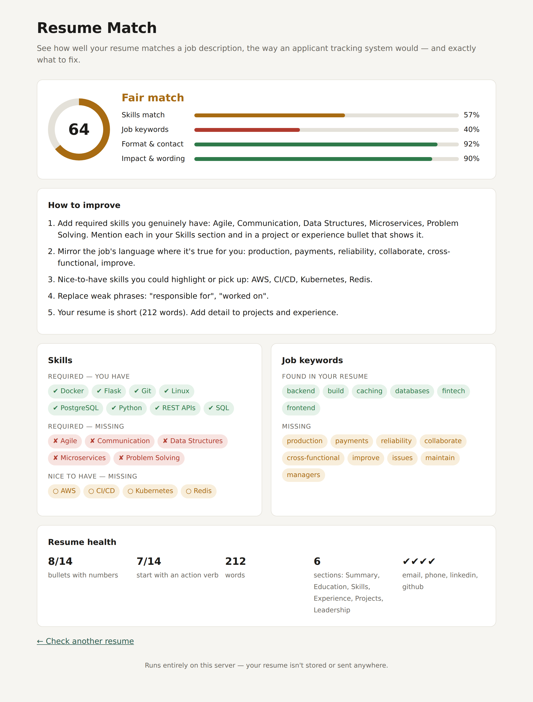

# resume-match

**See how well your resume matches a job description — the way an applicant tracking system (ATS) reads it — and get a specific list of what to fix.**

[](https://github.com/dhananjaypesu/resume-match/actions/workflows/tests.yml)


Most companies filter applications with software before a human reads them. `resume-match` compares your resume with a job posting and tells you which required skills are missing, which of the job's words you aren't using, and whether your bullets show real impact. It runs locally: your resume never leaves your machine.



## Features

- **Skill matching that understands synonyms.** 90+ skills with aliases, so `sklearn`, `Postgres`, `k8s` and `JS` count as scikit-learn, PostgreSQL, Kubernetes and JavaScript.
- **Required vs nice-to-have.** Reads the job's "Requirements" and "Nice to have" sections separately and weights them differently.
- **Understands "either/or".** If the job asks for "Flask or Django" and you have Flask, Django isn't flagged as missing.
- **Job keyword gap.** Finds the important non-skill words the posting repeats (like *payments*, *reliability*, *cross-functional*) and checks whether you use them.
- **Resume health checks.** Contact details, standard section headings, length, bullets with numbers, action verbs, and weak phrases like "responsible for".
- **Concrete suggestions** in priority order, not just a score.
- **Three ways to use it:** command line, web app, or JSON API.
- Reads **PDF, DOCX and TXT**.

## Quick start

```bash
git clone https://github.com/dhananjaypesu/resume-match.git
cd resume-match
pip install .
```

### Command line

```bash
resume-match my_resume.pdf job.txt
```

Try it on the bundled example:

```bash
resume-match examples/resume.txt examples/job_description.txt
```

```
  RESUME MATCH REPORT
  64/100  Fair match
  ██████████████████████████░░░░░░░░░░░░░░

  Skills match       ██████████████░░░░░░░░░░  57%  weight 50
  Job keywords       ██████████░░░░░░░░░░░░░░  40%  weight 20
  Format & contact   ██████████████████████░░  92%  weight 15
  Impact & wording   ██████████████████████░░  90%  weight 15

  ✔ Required skills you have
    Docker, Flask, Git, Linux, PostgreSQL, Python, REST APIs, SQL
  ✘ Required skills missing
    Agile, Communication, Data Structures, Microservices, Problem Solving
  ○ Nice-to-have skills missing
    AWS, CI/CD, Kubernetes, Redis
  ...

  How to improve
  1. Add required skills you genuinely have: Agile, Communication, ...
  2. Mirror the job's language where it's true for you: production, payments, reliability, ...
  3. Replace weak phrases: "responsible for", "worked on".
```

Paste a job description straight from the clipboard (macOS):

```bash
pbpaste | resume-match my_resume.pdf -
```

| Option | What it does |
|---|---|
| `--json` | Full result as JSON |
| `--markdown` | Markdown report |
| `-o report.md` | Save the report to a file |
| `--min-score 70` | Exit with code 1 if the score is below 70 (useful in scripts) |

### Web app

```bash
resume-match-web
```

Open http://127.0.0.1:5000, upload your resume, paste the job description, and click **Analyze match**. Use **See an example report** to try it instantly.

### JSON API

```bash
curl -X POST http://127.0.0.1:5000/api/analyze \
  -H "Content-Type: application/json" \
  -d '{"resume": "...resume text...", "job": "...job description..."}'
```

### As a Python library

```python
from resume_match import analyze

result = analyze(resume_text, job_text)
print(result.score, result.missing_required)
```

## How the score works

| Part | Weight | What it measures |
|---|---|---|
| Skills match | 50 | Required skills count double; soft skills count half |
| Job keywords | 20 | Share of the job's key terms that appear in your resume |
| Format & contact | 15 | Standard sections, email/phone/LinkedIn or GitHub, sensible length |
| Impact & wording | 15 | Bullets with numbers, action verbs, no weak phrases |

If a job description lists no recognisable skills, the skills weight moves to keywords and impact.

The score is a guide, not a verdict. Real ATS products differ, and the goal is a resume that's honest *and* easy for both software and people to read. Only add skills you actually have.

## Deploy your own (free)

The repo includes a `render.yaml`. On [Render](https://render.com), choose **New → Blueprint**, connect this repo, and it will build and start the web app with gunicorn.

## Project structure

```
resume_match/
  analyzer.py     # skill/keyword extraction, section and impact checks, scoring, suggestions
  skills.py       # skill taxonomy and aliases — easy to extend
  text.py         # PDF/DOCX/TXT reading, tokenising, phrase matching
  report.py       # terminal and Markdown output
  cli.py          # command-line interface
  web.py          # Flask web app and JSON API
  templates/
examples/         # sample resume and job description
tests/            # pytest suite (runs on every push via GitHub Actions)
```

## Contributing

The easiest way to help is to **add skills** to `resume_match/skills.py`, especially for fields beyond software (finance, marketing, design, healthcare). Each entry is a canonical name, a category and a list of aliases.

```bash
pip install -r requirements.txt
pytest
```

Issues and pull requests are welcome.

## Roadmap

- [ ] Highlight exactly where each skill appears in the resume
- [ ] Role presets (Data Analyst, SDE, Product, Business Development)
- [ ] Side-by-side comparison of two resume versions
- [ ] Optional semantic matching with sentence embeddings

## License

MIT
